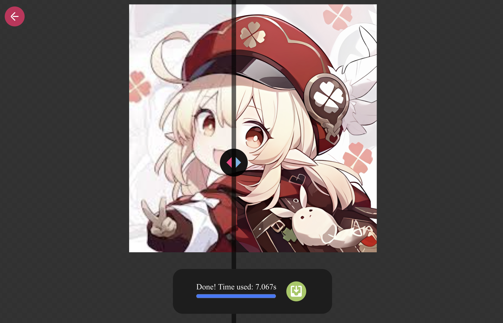

# web-realesrgan

Run Real-ESRGAN in the browser with tensorflow.js

## Usage

Drag in or select an image, then choose a model and WebGPU/WebGL to upscale the image.

Sure, PNG with alpha channel is supported.

### Online Demo

[https://cappuccino.moe](https://cappuccino.moe)



### Accelaration

- WebGL: Enabled on most devices by default.
- WebGPU: Enabled on Chrome with `chrome://flags/#enable-unsafe-webgpu` flag or other browsers with WebGPU support. Much faster than WebGL.

### Development

```bash
npm install
npm run dev
```

## Models

I've converted 4 models to tensorflow.js format, you can find the original pytorch models in [xinntao/Real-ESRGAN](https://github.com/xinntao/Real-ESRGAN)

- anime (fast) `RealESRGAN-animevideov3`
- anime (plus) `RealESRGAN_x4plus_anime_6B`
- general (fast) `RealESRGAN-general-x4v3`
- general (plus) `RealESRGAN_x4plus`

The first run will download the models and cache them in the browser indexedDB. No need to download them again.

## Credits

Pytorch model -> ONNX -> Tensorflow saved model -> Tensorflow.js

- [xinntao/Real-ESRGAN](https://github.com/xinntao/Real-ESRGAN)
- [microsoft/onnxruntime](https://github.com/microsoft/onnxruntime)
- [PINTO0309/onnx2tf](https://github.com/PINTO0309/onnx2tf)
- [tensorflow/tfjs](https://github.com/tensorflow/tfjs)
