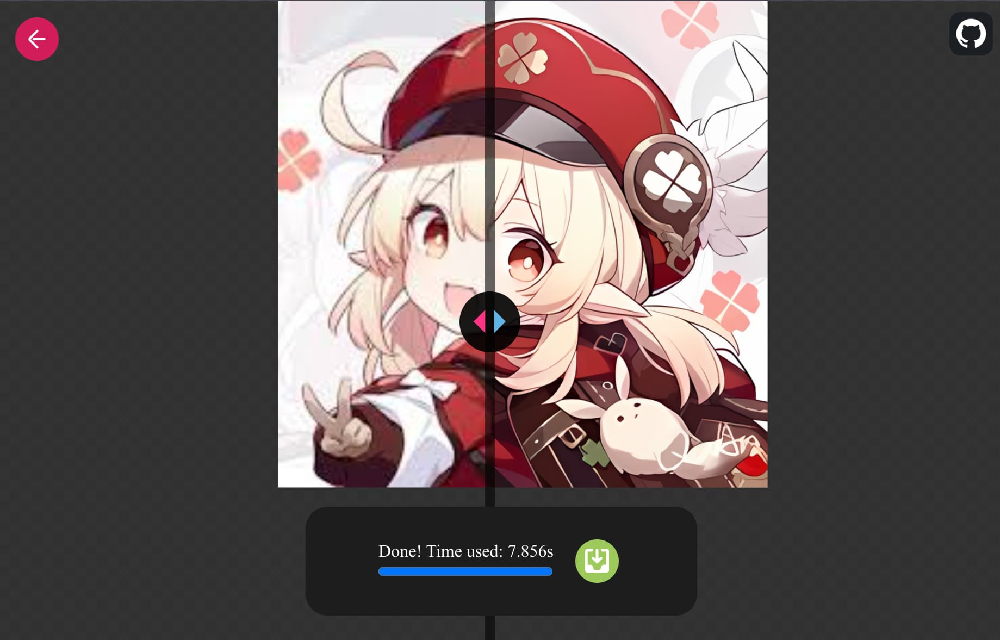
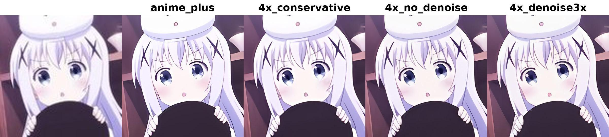
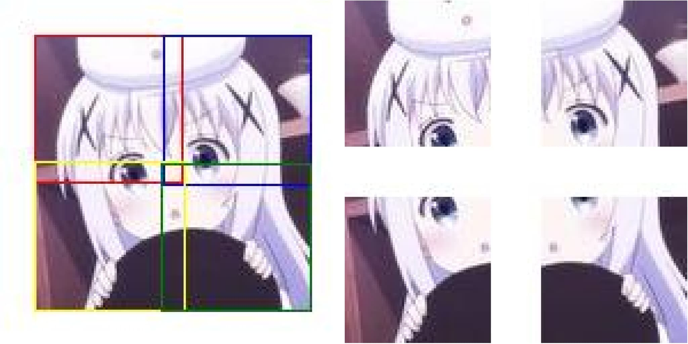

# web-realesrgan

Run Real-ESRGAN in the browser with tensorflow.js

## Usage

Drag in or select an image, then choose a model and WebGPU/WebGL to upscale the image.

Sure, PNG with alpha channel is supported.

### Online Demo

[https://cappuccino.moe](https://cappuccino.moe)



### Accelaration

- WebGL: Enabled on most devices by default.
- WebGPU: Enabled on Chrome on most devices. Much faster than WebGL. If you encounter issues. Try `chrome://flags/#enable-unsafe-webgpu` flag or other browsers with WebGPU support.

All models are quantized to FP16, which reduces the size of the model download and has no noticeable difference in performance compared to FP32 models. However, currently, the computation speed of FP16 is the same as FP32. Future updates from the TensorFlow.js team are expected to improve FP16 computation performance on WebGPU.

### Development

```bash
npm install
npm run dev
```

## Models

The first run will download the models and cache them in the browser indexedDB. No need to download them again.

Unfortunately, since the transformed model must determine the input size, you need to download the model separately for each different tile size.

I've converted 4 models to tensorflow.js format, you can find the original pytorch models in [xinntao/Real-ESRGAN](https://github.com/xinntao/Real-ESRGAN)

- anime_fast `RealESRGAN-animevideov3`
- anime_plus `RealESRGAN_x4plus_anime_6B`
- general_fast `RealESRGAN-general-x4v3`
- general_plus `RealESRGAN_x4plus`

Now supports [bilibili/ailab/Real-CUGAN](https://github.com/bilibili/ailab/tree/main/Real-CUGAN)🎉🎉🎉, which offers nearly the same restoration quality as Real-ESRGAN but is **up to 5x-10x faster**. 🥳🥳🥳

### Details

| Type        | Model        | Scale | Dtype | Size    | Denoise Level            |
| ----------- | ------------ | ----- | ----- | ------- | ------------------------ |
| Real-ESRGAN | anime_fast   | 4     | fp16  | 1.3 MB  | not adjustable           |
| Real-ESRGAN | anime_plus   | 4     | fp16  | 9.2 MB  | not adjustable           |
| Real-ESRGAN | general_fast | 4     | fp16  | 2.5 MB  | not adjustable           |
| Real-ESRGAN | general_plus | 4     | fp16  | 34.2 MB | not adjustable           |
| Real-CUGAN  | 2x           | 2     | fp16  | 2.6 MB  | conservative,0x,1x,2x,3x |
| Real-CUGAN  | 4x           | 4     | fp16  | 2.9 MB  | conservative,0x,3x       |

There is something wrong with Real-CUGAN 3x series models. 3x models are not available now.

## Best Practice

### Model Selection Guide

With nearly the same restoration quality, Real-CUGAN is **much faster** than Real-ESRGAN. **Real-CUGAN is a better choice in most cases.**

But **Real-ESRGAN may be better when the input image is very small.** Here, input is a 120x120 image.



### Understanding Parameters

- **Denoise**: "Denoise" refers to the process of reducing or removing noise from an image or audio signal. Noise can be any unwanted or random interference that distorts the clarity, like graininess in an image or background static in audio.

  - Conservative: This usually indicates a mild or conservative noise reduction approach, meaning it tries to keep the original details intact and avoids over-smoothing.

  - No-denoise: No noise reduction is applied, so the original noise and details are preserved.

  - Denoise1x: This refers to a light noise reduction, applying minimal processing to remove only some of the noise.

  - Denoise2x: This represents a moderate level of noise reduction, stronger than 1x, removing more noise but still maintaining some balance with the details.

  - Denoise3x: This is a strong noise reduction, which will remove most or all of the noise, but it might also cause some loss of fine details, making the image smoother.

- **Tile Size**: The image is not enlarged by the model as a whole; instead, it is split into tiles. The model enlarges each tile sequentially, and then all the tiles are stitched together to form the entire image.

  - On WebGL, larger tile sizes can make your device appear to lag during execution. If your device becomes laggy, you can reduce the tile size.
  - On WebGPU, larger tile sizes can speed up the entire process.

  - If your GPU can handle it, the larger the tile size, the faster the overall computation. Otherwise, smaller slices would be faster.

  **Example**: 120x120 image cut to 64x64 tiles



- **Overlap**: The default min_overlap is 12. When the image is split into tiles, adjacent tiles need to have overlap. Without overlap, the boundaries between two tiles can appear disconnected, resulting in a lack of smooth transitions.
  - You can set the overlap to 0 to observe this phenomenon.
  - If you notice horizontal or vertical dividing lines after enlarging the image, you can increase the overlap to improve the seamlessness.

## Credits

Pytorch model -> ONNX -> Tensorflow saved model -> Tensorflow.js

- [xinntao/Real-ESRGAN](https://github.com/xinntao/Real-ESRGAN)
- [microsoft/onnxruntime](https://github.com/microsoft/onnxruntime)
- [PINTO0309/onnx2tf](https://github.com/PINTO0309/onnx2tf)
- [tensorflow/tfjs](https://github.com/tensorflow/tfjs)
